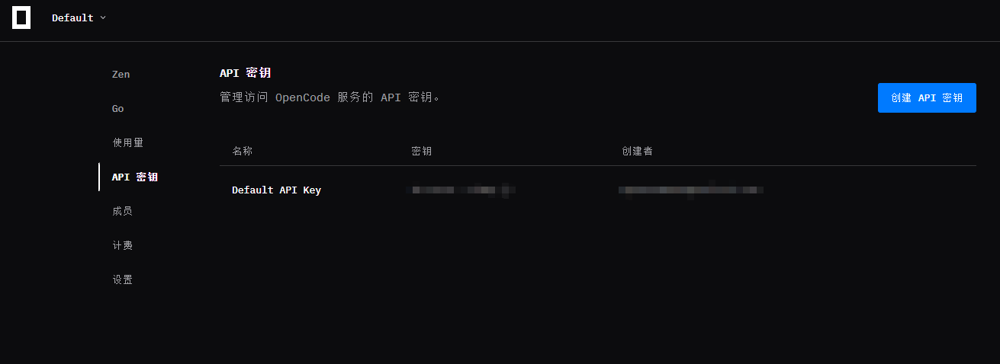

# zen-vision

Give text-only models (DeepSeek and friends) real eyes using **OpenCode Zen's free multimodal model** — a single-file script, zero downloads, zero cost.

中文 | [English](README.md)

If your DeepSeek is powerful but blind — it can't see the screenshots you paste, every `view_image` call is rejected, and debugging from a picture is impossible — this repository is for you. Instead of switching to an expensive multimodal model, it routes images through a **free vision model** (`mimo-v2.5-free` on OpenCode Zen) and hands your text-only model a **text description**. Your existing DeepSeek setup stays untouched.

No third-party files to download, no proxy to run, no MCP required to get started: one `.py` file + one `.env` with three lines.

## Quick Start (one-click)

Don't want to read the rest? Run the setup script:

- **Windows**: double-click `setup.bat`
- **Any OS**: `python setup.py`

It checks your Python, installs dependencies (`requests`, optional MCP), walks you through pasting your free Zen API key, generates `.env`, tests one image, and optionally wires up MCP for opencode / Claude Code / Codex. After it finishes:

```powershell
python vision.py your-image.png
```


## Real-world Effects

`vision.py screenshot.png` against a plain webpage:

> The page has a light background. A bold black heading at the top-left reads **"Example Domain"**, followed by a paragraph of small black text — "This domain is for use in documentation examples without needing permission. Avoid use in operations." — and a blue clickable **"Learn more"** link at the bottom.


A vision Q&A round trip — the model describes what it sees, then identifies the subject:


`--ocr` transcribes it verbatim:

```
Example Domain
This domain is for use in documentation examples without needing
permission. Avoid use in operations.
Learn more
```

## Highlights

- **Free**: uses OpenCode Zen's `mimo-v2.5-free` (Xiaomi MiMo-V2.5, multimodal flagship) — the *only* free model on Zen that actually accepts images (all 6 free models were tested; the other 5 reject images with HTTP 400).
- **Single file**: `vision.py` — the only dependency is `requests`. No clone, no build, no service to run.
- **Three modes**: describe, ask (`-q`), OCR (`--ocr`).
- **BOM-proof**: `.env` is read with `utf-8-sig`, so Windows Notepad / PowerShell writes just work.
- **Cloudflare-proof**: uses `requests` instead of `urllib` — `urllib`'s TLS fingerprint gets flagged by Zen's Cloudflare (403, error code 1010); `requests` passes.
- **Optional MCP server**: wrap it as a FastMCP server (`describe_image` / `ocr_image`) and plug DeepSeek into opencode, Claude Code, or Codex for a near-multimodal experience.

## Usage

```powershell
pip install requests

python vision.py screenshot.png                  # describe the image
python vision.py screenshot.png -q "dominant color?"   # ask a question
python vision.py screenshot.png --ocr            # verbatim text transcription
python vision.py a.png b.png                     # compare multiple images in one call
```

## Prerequisites

- Python 3.11+ (tested on 3.13)
- An OpenCode Zen API key (free; see below)
- `requests` (single pip install)

## Configuration

Create a `.env` file next to `vision.py` with exactly three lines:

| Variable | Required | Description |
|---|---|---|
| `VISION_API_KEY` | Yes | Your OpenCode Zen API key |
| `VISION_BASE_URL` | No (default) | `https://opencode.ai/zen/v1` |
| `VISION_MODEL` | Yes | `mimo-v2.5-free` (the free multimodal model) |
| `LANG` | No | `zh` (Chinese) or `en` (English); defaults to Chinese |

```
VISION_API_KEY=oc-...
VISION_BASE_URL=https://opencode.ai/zen/v1
VISION_MODEL=mimo-v2.5-free
LANG=zh
```


**Getting the key**: run `/connect` inside opencode, pick **OpenCode Zen**, and copy the API key from the opened browser page. It's stored locally in `.local/share/opencode/auth.json`.



## Optional: MCP Server (Multi-Agent)

`mcp_server.py` exposes the same engine as `describe_image(path, query?)` and `ocr_image(path)` via FastMCP (stdio). Wire it into any MCP client:

- **opencode** — add to `opencode.jsonc`:
  ```jsonc
  "vision": {
    "type": "local",
    "command": ["python", "E:\\path\\to\\mcp_server.py"],
    "environment": { "CODEX_VISION_PROXY_ENV": "E:\\path\\to\\.env" },
    "enabled": true
  }
  ```
- **Claude Code**:
  ```powershell
  claude mcp add vision -s user -e "CODEX_VISION_PROXY_ENV=E:\path\to\.env" -- python E:\path\to\mcp_server.py
  ```
- **Codex CLI** — append to `~/.codex/config.toml`:
  ```toml
  [mcp_servers.vision]
  command = "python"
  args = ["E:\\path\\to\\mcp_server.py"]
  env = { CODEX_VISION_PROXY_ENV = "E:\\path\\to\\.env" }
  ```

## How It Works

```
Your text-only model (DeepSeek)
        │  asks to "see" an image
        ▼
vision.py / mcp_server.py
        │  image -> base64 data URL
        ▼
OpenCode Zen API  https://opencode.ai/zen/v1/chat/completions
        │  model: mimo-v2.5-free (multimodal)
        ▼
text description / verbatim OCR
        ▼
DeepSeek (text-only) → now it "sees"
```

The image never reaches DeepSeek. A vision model describes it, and the description is what your text-only model reasons over — *Describe-then-Reason* (Prism, NeurIPS 2024).

## FAQ

**Why `requests` and not `urllib`?**
Because `urllib`'s TLS fingerprint is flagged by Cloudflare in front of OpenCode Zen → `403 error code: 1010`. `requests` passes. Don't "simplify" it back.

**Why does `.env` load with `utf-8-sig`?**
Windows PowerShell `Set-Content -Encoding UTF8` writes a BOM; a plain read turns `VISION_API_KEY` into `\ufeffVISION_API_KEY` and the key silently fails to match. `utf-8-sig` strips it.

**Which free Zen models can see images?**
Only `mimo-v2.5-free`. Tested on 2026-08: `deepseek-v4-flash-free`, `ling-3.0-flash-free`, `nemotron-3-ultra-free`, `north-mini-code-free`, `laguna-s-2.1-free` all reject image input (HTTP 400).

**Can I use another vision API?**
Yes — any OpenAI-compatible endpoint supporting `image_url` works (GLM-4V, Kimi, qwen-vl, Gemini, ...). Change the three `.env` lines.

**Is this really free?**
The model is free for a limited time while it's in Zen's free tier. Data sent during the free period may be used to improve the model — don't send anything sensitive.

## File Listing

| File | Purpose |
|---|---|
| `vision.py` | Single-file CLI: describe / Q&A / OCR |
| `setup.py` / `setup.bat` | One-click setup: dependencies, `.env`, optional MCP wiring |
| `mcp_server.py` | Optional FastMCP server exposing `describe_image` / `ocr_image` |
| `.env.example` | Configuration template |
| `photo/` | Screenshots used in this README |

## Limitations

- Image-to-text only: the vision model's description is lossy; fine-grained pixel details may be missed.
- Description quality depends on the configured vision model.
- The free model is time-limited and collects data during the free period.

## Credits

Inspired by and largely built on [Anionex/codex-vision-proxy](https://github.com/Anionex/codex-vision-proxy) (MIT) — a beautifully small image-to-text toolkit (glance / ground / trace). This repo adapts it to OpenCode Zen's free tier, adds Windows pitfall fixes, and packages it as a single self-contained script.

Built with DeepSeek, inspired by [Anionex/codex-vision-proxy](https://github.com/Anionex/codex-vision-proxy).
