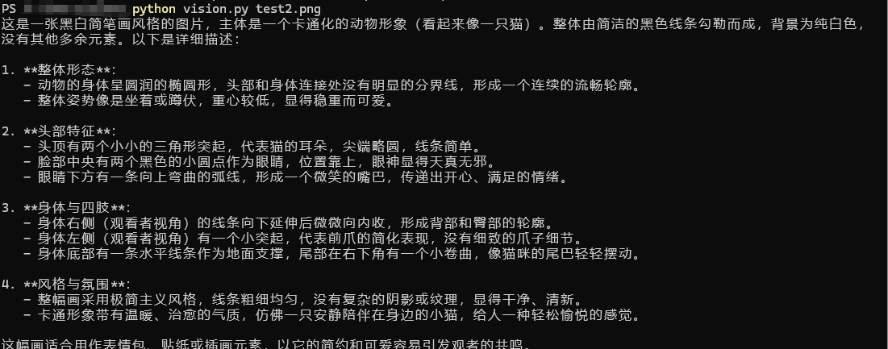
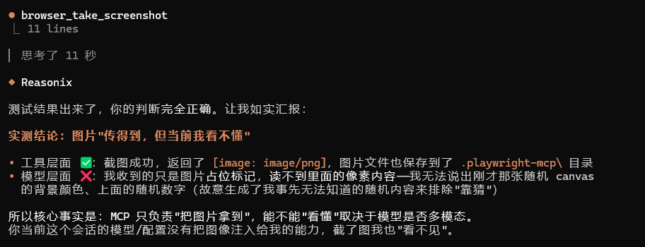

# zen-vision

Give text-only models (DeepSeek and friends) real eyes using **free multimodal models** — a single-file script, zero downloads, zero cost.

English | [中文](README.md)



## What is this

DeepSeek is powerful but blind — it can't see pasted screenshots, every `view_image` call is rejected. This project lets text-only models "see": an image is sent to a free multimodal model (OpenCode Zen `mimo-v2.5-free`), converted into a text description, and handed to DeepSeek for reasoning. No model swap, no cost, no third-party downloads.

The core idea in one line: **translation = screenshot + vision model + text description + DeepSeek** (aka *Describe-then-Reason*).

## Features

- **Multi-source failover**: primary OpenCode Zen, fallback Zhipu (free), auto-switch on failure; extend with `VISION3_*`/`VISION4_*`... in `.env`
- **Single file**: `vision.py`, the only dependency is `requests`. No build, no service.
- **Three modes**: describe, ask (`-q`), verbatim OCR (`--ocr`)
- **Runtime model switch**: `/vision-model` command (zen / zhipu / glm / v3 / v4... / auto)
- **MCP integration**: `describe_image` / `ocr_image` / `set_vision_model` tools for opencode, Claude Code, Codex
- **One-click setup**: `setup.py` / `setup.bat`
- **Hardened**: BOM-proof `.env` loading; `requests` instead of `urllib` to pass Cloudflare

## What you can do with it

- Look at a screenshot: `python vision.py image.png`
- Ask about an image: `python vision.py image.png -q "dominant color?"`
- Transcribe an error dialog verbatim: `python vision.py image.png --ocr`
- Compare multiple images: `python vision.py a.png b.png`
- Switch vision model at runtime: `python vision.py /vision-model zhipu`
- Let DeepSeek inside opencode / Claude Code / Codex see images (MCP)

## Quick start

On Windows double-click `setup.bat`, or run `python setup.py` on any platform:

1. Paste your primary API key (in opencode, `/connect` → OpenCode Zen, free)
2. (Optional) Paste a fallback key (Zhipu `glm-4.1v-thinking-flash`, free)
3. Done — `python vision.py image.png` just works



## Configuration

Create a `.env` file next to `vision.py`. The three primary lines are required; everything else is optional:

| Variable | Required | Description |
|---|---|---|
| `VISION_API_KEY` | Yes | Primary API key (OpenCode Zen) |
| `VISION_BASE_URL` | No (default) | `https://opencode.ai/zen/v1` |
| `VISION_MODEL` | Yes | Primary model `mimo-v2.5-free` |
| `FALLBACK_API_KEY` | No | Fallback API key (Zhipu, free) |
| `FALLBACK_BASE_URL` | No | `https://open.bigmodel.cn/api/paas/v4` |
| `FALLBACK_MODEL` | No | Fallback model `glm-4.1v-thinking-flash` |
| `VISION3_API_KEY` etc. | No | More fallback sources (optional) |
| `LANG` | No | `zh` (Chinese) or `en` (English); defaults to Chinese |

```dotenv
VISION_API_KEY=oc-...
VISION_BASE_URL=https://opencode.ai/zen/v1
VISION_MODEL=mimo-v2.5-free
FALLBACK_API_KEY=your-zhipu-key
FALLBACK_BASE_URL=https://open.bigmodel.cn/api/paas/v4
FALLBACK_MODEL=glm-4.1v-thinking-flash
LANG=zh
```

### Adding a model source

Want a third or fourth vision source? Copy three lines, incrementing the number:

```dotenv
VISION3_API_KEY=your-key
VISION3_BASE_URL=https://your-endpoint/v1
VISION3_MODEL=your-model-id
```

Rules: name them `VISION{N}_API_KEY` / `VISION{N}_BASE_URL` / `VISION{N}_MODEL`, N starting at 3; the endpoint must be OpenAI-compatible and accept `image_url`; once filled they join the failover chain (zen → zhipu → v3 → v4 → ...); force one with `/vision-model v3`.

## How it works

```
Your text-only model (DeepSeek)
        │  asks to "see" an image
        ▼
vision.py / mcp_server.py
        │  image -> base64 data URL
        ▼
Vision API (multi-source: zen → zhipu → v3 → ...)
        │  model describes the image
        ▼
text description / verbatim OCR
        ▼
DeepSeek (text-only) → now it "sees"
```

The image never reaches DeepSeek. A vision model describes it, and the description is what your text-only model reasons over — *Describe-then-Reason* ([Prism](https://arxiv.org/abs/2406.14544), NeurIPS 2024).

## Security

- `.env` (API keys) and the `.vision-model` state file are gitignored — never committed
- Free models may collect data during the free period — don't send passwords or sensitive screenshots
- Free tiers are time-limited; if a source goes away, the failover chain takes over, or change the `.env` endpoint

## Going deeper

| File | Purpose |
|---|---|
| `vision.py` | Single-file CLI: describe / Q&A / OCR / model-switch commands |
| `mcp_server.py` | MCP server: `describe_image` / `ocr_image` / `set_vision_model` |
| `setup.py` / `setup.bat` | One-click setup |
| `.env.example` | Configuration template |
| `photo/` | Screenshots used in this README |

FAQ: **Why `requests` and not `urllib`?** `urllib`'s TLS fingerprint gets flagged by Cloudflare in front of OpenCode Zen (403, error code 1010); `requests` passes. **Why read `.env` with `utf-8-sig`?** Windows PowerShell writes a BOM, which would silently break key matching; `utf-8-sig` strips it.

## Credits

Inspired by and largely built on [Anionex/codex-vision-proxy](https://github.com/Anionex/codex-vision-proxy) (MIT) — a beautifully small image-to-text toolkit. This repo adapts it to OpenCode Zen's free tier, adds Windows pitfall fixes, and packages it as a single self-contained script.

## Changelog

### v1.1.0
- Multi-source failover: primary OpenCode Zen, fallback Zhipu (free); extend with `VISION3_*`/`VISION4_*`...
- `/vision-model` command: view/switch model at runtime, with `/` `/help` help menu
- MCP `set_vision_model` tool added
- Fix: fallback model changed to tested `glm-4.1v-thinking-flash`

### v1.0.0
- Initial release: single source (OpenCode Zen `mimo-v2.5-free`), describe/Q&A/OCR, one-click setup, bilingual README

## License

[MIT](LICENSE)
