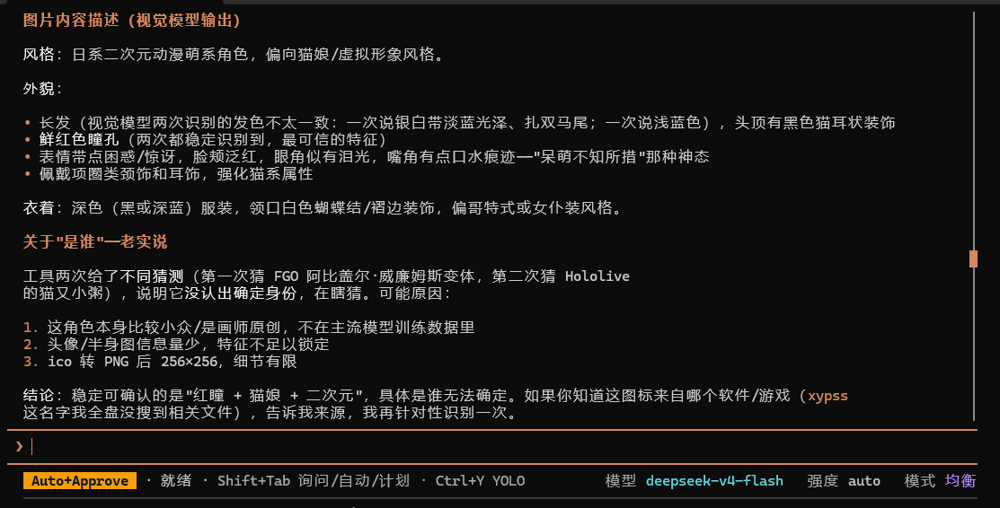
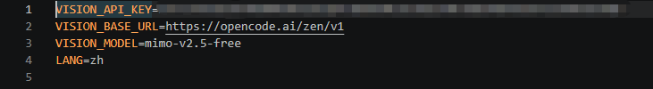

# zen-vision

用 **OpenCode Zen 的免费多模态模型**给纯文本模型（DeepSeek 等）装上眼睛——单文件脚本、零下载、零成本。

中文 | [English](README_EN.md)

如果你的 DeepSeek 很强但"瞎"：看不到你贴的截图、`view_image` 全被拒、没法从图片里 debug——这个仓库就是给你的。它不换昂贵的多模态主模型，而是把图片交给 **[OpenCode Zen](https://opencode.ai/docs/zen/) 上的免费视觉模型**（`mimo-v2.5-free`），把**文字描述**喂给你的纯文本模型。现有 DeepSeek 配置完全不动。


不需要下载任何第三方文件、不需要跑代理、起步也不需要 MCP：**一个 `.py` 文件 + 一个三行的 `.env`** 就够了。

## 一键使用（新手看这个）

不想看后面教程？直接跑配置脚本：

- **Windows**：双击 `setup.bat`
- **任意系统**：`python setup.py`

它会自动检查 Python、安装依赖（`requests`，可选 MCP）、引导你粘贴免费的 Zen API key、生成 `.env`、测一张图，还可以一键接入 opencode / Claude Code / Codex 的 MCP。跑完之后：

```powershell
python vision.py 你的图片.png
```

## 实际效果

对一张普通网页截图执行 `python vision.py screenshot.png`：

> 页面背景为浅色。左上角黑色粗体大标题 **"Example Domain"**，下方一段黑色小字说明——"This domain is for use in documentation examples without needing permission. Avoid use in operations."——底部还有一个蓝色可点击的 **"Learn more"** 链接。


一轮视觉问答——模型先描述所见，再识别主体：



`--ocr` 逐字转写：

```
Example Domain
This domain is for use in documentation examples without needing
permission. Avoid use in operations.
Learn more
```

## 亮点

- **免费**：用 OpenCode Zen 的 `mimo-v2.5-free`（小米 MiMo-V2.5 多模态旗舰）——Zen 免费档里**唯一**真正能收图的模型（6 个免费模型全部实测过，其余 5 个收图直接 HTTP 400）。
- **多源容灾**：主源失败/限流/超时自动切换备用源（智谱免费视觉模型），一个源挂了视觉不瘫。
- **单文件**：`vision.py`，唯一依赖是 `requests`。不用 clone、不用编译、不用跑服务。
- **三种模式**：描述、提问（`-q`）、OCR（`--ocr`）。
- **BOM 免疫**：`.env` 用 `utf-8-sig` 读取，Windows 记事本 / PowerShell 随便存都不会读不到 key。
- **Cloudflare 免疫**：用 `requests` 而非 `urllib`——`urllib` 的 TLS 指纹会被 Zen 前面的 Cloudflare 拦（403，error code 1010），`requests` 实测能过。
- **可选 MCP**：封装成 FastMCP server（`describe_image` / `ocr_image`），接入 opencode、Claude Code、Codex，体验接近真·多模态。

## 用法

```powershell
pip install requests

python vision.py screenshot.png                     # 描述图片
python vision.py screenshot.png -q "主色是什么"      # 针对图片提问
python vision.py screenshot.png --ocr              # 逐字转写图中文字
python vision.py a.png b.png                       # 一次对比多张图
python vision.py /vision-model list                # 列出所有已配置模型
python vision.py /vision-model v3                  # 切换模型（zen/zhipu/glm/v3/v4.../auto）
```

## 前置条件

- Python 3.11+（3.13 实测通过）
- 一个 OpenCode Zen API key（免费获取，见下）
- `requests`（一条 pip 命令）

## 配置

在 `vision.py` 同目录建一个 `.env`，就三行：

| 变量 | 必填 | 说明 |
|---|---|---|
| `VISION_API_KEY` | 是 | 主源 API key（OpenCode Zen） |
| `VISION_BASE_URL` | 否（有默认） | `https://opencode.ai/zen/v1` |
| `VISION_MODEL` | 是 | 主源模型 `mimo-v2.5-free` |
| `FALLBACK_API_KEY` | 否 | 备用源 API key（智谱，免费） |
| `FALLBACK_BASE_URL` | 否 | `https://open.bigmodel.cn/api/paas/v4` |
| `FALLBACK_MODEL` | 否 | 备用源模型 `glm-4.1v-thinking-flash`（免费） |
| `VISION3_API_KEY` 等 | 否 | 更多备用源（自选，可加 `VISION4_*`…） |
| `LANG` | 否 | `zh`（中文）或 `en`（英文），默认中文 |

```
VISION_API_KEY=oc-...
VISION_BASE_URL=https://opencode.ai/zen/v1
VISION_MODEL=mimo-v2.5-free
FALLBACK_API_KEY=你的智谱key
FALLBACK_BASE_URL=https://open.bigmodel.cn/api/paas/v4
FALLBACK_MODEL=glm-4.1v-thinking-flash
# 想加更多备用源？照抄三行改成 VISION3_ / VISION4_ ... 即可（填了自动进 fallback 链）
# VISION3_API_KEY=
# VISION3_BASE_URL=
# VISION3_MODEL=
LANG=zh
```



### 新增模型源（格式要求）

想加第三个、第四个视觉源？在 `.env` 里照抄三行，**编号递增**：

```dotenv
VISION3_API_KEY=你的key
VISION3_BASE_URL=https://你的端点/v1
VISION3_MODEL=你的模型ID
```

规则：

| 项 | 要求 |
|---|---|
| 命名 | `VISION{N}_API_KEY` / `VISION{N}_BASE_URL` / `VISION{N}_MODEL`，N 从 **3** 开始递增（3、4、5…） |
| 端点 | OpenAI 兼容的 `/chat/completions`，支持 `image_url` 图片输入 |
| 生效 | 填了自动进 fallback 链（zen → zhipu → v3 → v4 → …），主源挂了按序切换 |
| 切换 | `python vision.py /vision-model v3` 强制用该源，`/vision-model auto` 恢复自动 |

**怎么拿 key**：在 [opencode](https://opencode.ai) 里执行 `/connect`，选 **OpenCode Zen**，浏览器打开的页面里复制 API key。key 存在本机 `.local/share/opencode/auth.json`。


## 可选：MCP Server（多 Agent 通用）

`mcp_server.py` 通过 FastMCP（stdio）把同一套引擎暴露为 `describe_image(path, query?)` 和 `ocr_image(path)` 两个工具，接进任意 MCP 客户端：

- **opencode** — 在 `opencode.jsonc` 里加：
  ```jsonc
  "vision": {
    "type": "local",
    "command": ["python", "E:\\path\\to\\mcp_server.py"],
    "environment": { "CODEX_VISION_PROXY_ENV": "E:\\path\\to\\.env" },
    "enabled": true
  }
  ```
- **Claude Code**：
  ```powershell
  claude mcp add vision -s user -e "CODEX_VISION_PROXY_ENV=E:\path\to\.env" -- python E:\path\to\mcp_server.py
  ```
- **Codex CLI** — 追加到 `~/.codex/config.toml`：
  ```toml
  [mcp_servers.vision]
  command = "python"
  args = ["E:\\path\\to\\mcp_server.py"]
  env = { CODEX_VISION_PROXY_ENV = "E:\\path\\to\\.env" }
  ```

## 原理

```
你的纯文本模型（DeepSeek）
        │  想看一张图
        ▼
vision.py / mcp_server.py
        │  图片 → base64 data URL
        ▼
OpenCode Zen API  https://opencode.ai/zen/v1/chat/completions
        │  模型：mimo-v2.5-free（多模态）
        ▼
文字描述 / 逐字 OCR
        ▼
DeepSeek（纯文本）→ 现在它"看见"了
```

图片永远不会直接进 DeepSeek：由视觉模型描述，纯文本模型拿描述做推理——*Describe-then-Reason*（[Prism](https://arxiv.org/abs/2406.14544), NeurIPS 2024）。

## FAQ

**为什么用 `requests` 不用 `urllib`？**
因为 `urllib` 的 TLS 指纹被 OpenCode Zen 前面的 Cloudflare 识别拦截 → `403 error code: 1010`。`requests` 能过。别"好心"改回 urllib。

**为什么 `.env` 用 `utf-8-sig` 读？**
Windows PowerShell 的 `Set-Content -Encoding UTF8` 会写 BOM，普通读法会把 `VISION_API_KEY` 读成 `\ufeffVISION_API_KEY`，key 悄悄匹配失败。`utf-8-sig` 自动剥掉 BOM。

**Zen 免费模型里哪些能看图？**
只有 `mimo-v2.5-free`。2026-08 实测：`deepseek-v4-flash-free`、`ling-3.0-flash-free`、`nemotron-3-ultra-free`、`north-mini-code-free`、`laguna-s-2.1-free` 收图全部 HTTP 400。

**能换别的视觉 API 吗？**
能——任何支持 `image_url` 的 OpenAI 兼容端点都行（[GLM-4V](https://open.bigmodel.cn/)、[Kimi](https://platform.moonshot.cn/)、[qwen-vl](https://help.aliyun.com/zh/model-studio/)、[Gemini](https://ai.google.dev/)……），改 `.env` 三行即可。

**主源挂了怎么办？**
自动切换备用源（`.env` 里配了 `FALLBACK_*` 三行后）。实测：主源 401/限流/超时 → 自动用智谱 `glm-4.1v-thinking-flash`（免费）接管；两源都挂才会报错，错误信息会标明哪个源失败。

**真的免费吗？**
模型在 Zen 免费档期间免费（限时）。免费期间发送的数据可能被用于模型改进——别发敏感内容。

## 文件清单

| 文件 | 用途 |
|---|---|
| `vision.py` | 单文件 CLI：描述 / 问答 / OCR |
| `setup.py` / `setup.bat` | 一键配置：装依赖、生成 `.env`、可选接入 MCP |
| `mcp_server.py` | 可选 FastMCP server，暴露 `describe_image` / `ocr_image` |
| `.env.example` | 配置模板 |
| `photo/` | 本 README 使用的截图 |

## 限制

- 仅"图转文字"：视觉模型的描述有损，细粒度像素细节可能丢失。
- 描述质量取决于所配的视觉模型。
- 免费模型限时，免费期间会收集数据。

## 致谢

思路与核心代码大量参考 [Anionex/codex-vision-proxy](https://github.com/Anionex/codex-vision-proxy)（MIT）——一个精炼的"图转文字"工具包（glance / ground / trace）。本仓库把它适配到 OpenCode Zen 的免费档，补上 Windows 的排雷，并打包成单文件自包含脚本。
